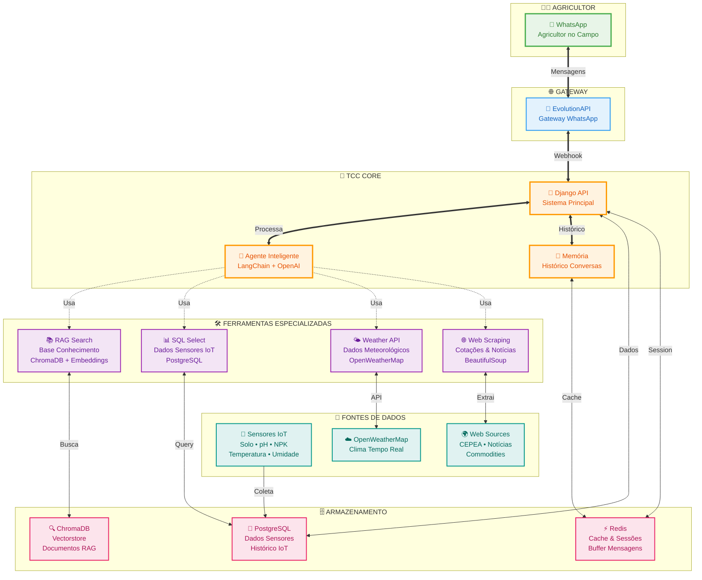

# 🌾 TCC - Assistente Técnico Agrícola com IA

Sistema inteligente de assistência técnica agrícola que integra **WhatsApp**, **sensores IoT**, **Retrieval-Augmented Generation (RAG)** e **OpenAI** para fornecer orientações personalizadas para pequenos agricultores e produtores familiares.

## 🌟 Características Principais

- **🌾 Assistência Agrícola Especializada**: Orientações técnicas para cultivos, manejo e práticas sustentáveis
- **💬 Integração WhatsApp**: Acesso via mensagem para agricultores no campo
- **🧠 IA Agrícola**: OpenAI GPT-4o-mini com conhecimento técnico especializado
- **🌱 Sensores IoT**: Monitoramento em tempo real de solo, clima e nutrientes
- **📚 Base de Conhecimento RAG**: Documentos técnicos, manuais e boas práticas
- **🌤️ Dados Meteorológicos**: Informações climáticas via OpenWeatherMap
- **🌐 Web Scraping**: Cotações de commodities e notícias do agronegócio
- **💾 Histórico Inteligente**: Memória contextualizada por propriedade
- **🐳 Deploy Robusto**: Containerização completa para produção
- **⚡ Performance Otimizada**: Cache Redis e consultas SQL eficientes

## 🏗️ Arquitetura do Sistema

### O projeto é dividido em três módulos principais:

| Módulo | Descrição |
|--------|------------|
| [Backend](./backend/README.md) | API responsável pelo processamento de dados, integração e persistência. |
| [Frontend](./frontend/README.md) | Colocar aqui |
| [Hardware](./hardware/README.MD) | Código-fonte Arduino, montagem do circuito e configuração do ESP32 LoRa OLED V2. |

**Infrastructure:**

- **Docker & Docker Compose** - Containerização
- **EvolutionAPI** - Gateway WhatsApp
- **Gunicorn** - Servidor WSGI

### Arquitetura do TCC



## 🚀 Tecnologias e Dependências

### Dependências Principais (backend)

| Tecnologia            | Versão                  | Propósito Agrícola               |
| --------------------- | ----------------------- | -------------------------------- |
| Python                | ≥3.11,<3.15             | Runtime principal                |
| Django                | ^5.2.6                  | Framework web + sensores IoT     |
| Django REST Framework | ^3.16.1                 | API REST para webhooks           |
| OpenAI                | ^1.107.0                | TCC - IA agrícola                |
| LangChain             | ^0.3.27                 | Agente com ferramentas           |
| LangChain-OpenAI      | ^0.3.33                 | Integração GPT-4o-mini           |
| LangChain-Chroma      | ^0.2.6                  | RAG - base conhecimento agrícola |
| BeautifulSoup4        | ^4.12.3                 | Web scraping - cotações/notícias |
| Requests              | ^2.32.3                 | HTTP client - APIs externas      |
| Redis                 | ^6.4.0                  | Cache + buffer mensagens         |
| PostgreSQL            | psycopg2-binary ^2.9.10 | Dados sensores + histórico       |
| Python-decouple       | ^3.8                    | Configuração segura              |

### Dependências de Desenvolvimento (backend)

- **pytest** ^8.4.2 - Framework de testes
- **pytest-django** ^4.11.1 - Testes Django
- **pytest-cov** ^6.3.0 - Cobertura de testes

### 📋 Pré-requisitos (backend)

- **Docker** e **Docker Compose**
- **Git**
- **Chave da OpenAI API**
- **Instância EvolutionAPI configurada**

### Dependências Principais (hardware)

| Tecnologia / Biblioteca | Versão / Fabricante | Função no Projeto Agrícola |
| ----------------------- | ------------------  | -------------------------- |
| Arduino IDE             | ≥2.3.0              | Ambiente de desenvolvimento|
| Heltec ESP32 Dev-Boards | by Heltec Automation| Suporte à placa ESP32 LoRa V2 |
| LoRa                    | by Sandeep Mistry   | Comunicação sem fio LoRa entre módulos |
| ArduinoJson             | by Benoit Blanchon  | Estruturação e parse de dados em JSON |
| Driver CP210x           | Silicon Labs        | Reconhecimento USB do ESP32 LoRa V2 |
| MAX485 UART Module      | TTL ↔ RS485 Converter  | Interface entre sensor e ESP32 |
| Sensor RS485 (pH, Umidade, Temp, NPK, Salinidade) | RS485 Modbus  | Coleta de dados do solo |
| Protoboard 400 pontos   |                         | Montagem de testes e prototipagem |

---

### Dependências de Desenvolvimento (hardware)

- **Biblioteca Heltec ESP32** – recursos de OLED, LoRa e WiFi integrados  
- **Biblioteca LoRa** – comunicação via rádio entre módulos  
- **Biblioteca ArduinoJson** – formatação dos dados coletados para envio  
- **Drivers CP210x** – reconhecimento do dispositivo pela porta serial

---

### 📋 Pré-requisitos (hardware)

- **Arduino IDE** instalada (≥ 2.3.0)  
  🔗 [https://www.arduino.cc/en/software](https://www.arduino.cc/en/software)

- **Gerenciador de placas configurado** com URL adicional:
https://resource.heltec.cn/download/package_heltec_esp32_index.json

## 🛠️ Ferramentas do TCC

O TCC possui 4 ferramentas especializadas para auxiliar os agricultores:

### 1. 📚 `rag_search` - Base de Conhecimento Agrícola

**Tecnologia**: ChromaDB + OpenAI Embeddings  
**Uso**: Consulta documentos técnicos, manuais e boas práticas agrícolas

**Exemplos:**

- "Qual o espaçamento ideal para plantio de milho safrinha?"
- "Como identificar e controlar a lagarta-do-cartucho no milho?"
- "Técnicas de irrigação por gotejamento para hortaliças"

### 2. 📊 `sql_select` - Dados dos Sensores IoT

**Tecnologia**: PostgreSQL + Django ORM  
**Uso**: Consulta histórico de sensores de solo, clima e nutrientes

**Dados Disponíveis:**

- Umidade do solo (%), temperatura (°C), pH
- NPK - Nitrogênio, Fósforo, Potássio (ppm)
- Condutividade elétrica, salinidade, TDS

**Exemplos:**

- "Qual foi a média de umidade do solo na semana passada?"
- "Mostre o pH do solo nos últimos 7 dias"
- "Níveis de NPK desta semana comparado com o mês anterior"

### 3. 🌤️ `weather_search` - Dados Meteorológicos

**Tecnologia**: OpenWeatherMap API  
**Uso**: Condições climáticas para decisões agrícolas

**Exemplos:**

- "Condições de vento para aplicação de defensivos hoje?"
- "Umidade relativa ideal para plantio de hortaliças?"
- "Previsão de chuva - devo adiar a colheita?"

### 4. 🌐 `web_scraping` - Mercado e Cotações

**Tecnologia**: BeautifulSoup + Requests  
**Uso**: Preços atuais e notícias do agronegócio

**Exemplos:**

- "Preço atual da saca de milho na CEPEA/ESALQ"
- "Cotação da arroba do boi gordo no mercado"
- "Notícias sobre nova cultivar de soja resistente à seca"

## 🎯 Uso do Sistema

### API Endpoints

| Endpoint                | Método | Descrição                       |
| ----------------------- | ------ | ------------------------------- |
| `/api/chatbot/webhook/` | POST   | Webhook para mensagens WhatsApp |
| `/api/sensors/webhook/` | POST   | Webhook para sensores (futuro)  |
| `/admin/`               | GET    | Painel administrativo Django    |
| `/api/schema/`          | GET    | Documentação OpenAPI            |
| `/ht/`                  | GET    | Health check dos serviços       |

### Fluxo de Funcionamento do TCC

1. **📱 Agricultor no WhatsApp** → Envia dúvida técnica
2. **🔗 EvolutionAPI** → Recebe e encaminha via webhook
3. **🤖 TCC Processa:**
   - Analisa contexto da pergunta
   - Identifica ferramentas necessárias
   - Executa consultas apropriadas:
     - 📚 RAG → Busca conhecimento técnico
     - 📊 SQL → Consulta sensores IoT
     - 🌤️ Weather → Dados meteorológicos
     - 🌐 Scraping → Cotações/notícias
4. **🧠 OpenAI** → Gera resposta técnica personalizada
5. **💾 Redis** → Salva histórico da propriedade
6. **📤 Resposta** → Enviada via WhatsApp ao agricultor

### Processamento da Base de Conhecimento

Os documentos agrícolas são processados e otimizados para busca:

- **Chunking**: 1000 caracteres com sobreposição de 200
- **Embeddings**: OpenAI text-embedding-ada-002
- **Vectorstore**: ChromaDB para busca semântica
- **Indexação**: Automática ao reiniciar o sistema
- **Busca**: Similaridade vetorial + contexto agrícola

## 🔧 Desenvolvimento

### Estrutura do Projeto

```
backend/
├── 📁 chatbot/              # TCC - Módulo principal
│   ├── chains.py           # Agente LangChain + Ferramentas
│   ├── config.py          # Configurações (incluindo AI_SYSTEM_PROMPT)
│   ├── evolution_api.py   # Cliente WhatsApp
│   ├── memory.py          # Histórico por propriedade
│   ├── prompts.py         # Prompt do TCC
│   ├── tools.py           # 4 Ferramentas (RAG, SQL, Weather, Scraping)
│   ├── vectorstore.py     # ChromaDB - Base conhecimento
│   └── views.py           # Webhooks e API
├── 📁 sensors/             # Módulo sensores IoT
│   ├── models.py          # Modelo dados sensores
│   └── views.py           # Webhook sensores
├── 📁 core/               # Django core settings
├── 📁 rag_files/          # 📚 Documentos técnicos agrícolas
│   └── processed/         # Documentos processados
├── 📁 vectorstore/        # 🗄️ ChromaDB storage
├── docker-compose.yml     # Containers (Django + Redis + PostgreSQL)
├── Dockerfile            # Imagem Python otimizada
├── pyproject.toml        # Poetry - dependências
└── .env.example          # Variáveis (incluindo prompt personalizado)
hardware/
├── ReceiverLoraTCC.ino
├── SenderLoraTCC.ino
```

## 👥 Desenvolvedores

- [Leonardo Arouche](https://github.com/LeoPDA)
- [Kayky Vasconcelos](https://github.com/kaykyvasconcelos)
- [Rafael Ferreira Machado](https://github.com/rafaelmachadobr)
- [Samara Marques](https://github.com/samrqs)
- [Thais](https://github.com/thaisisi)
